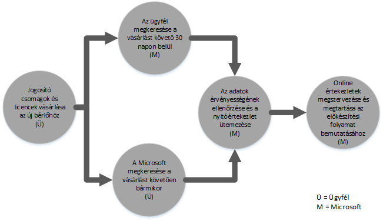
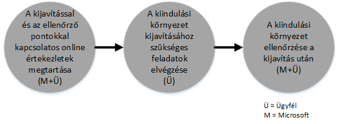
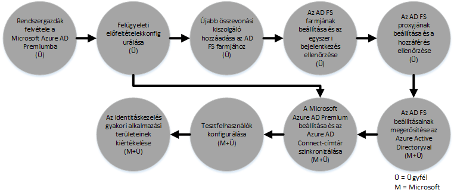

# Az Azure Rights Management szolg&#225;ltat&#225;shoz k&#233;sz&#252;lt FastTrack Center juttat&#225;s folyamata
Ha a szervezete nem jogosult az Azure Rights Management szolgáltatáshoz készült FastTrack Center juttatásra, a Microsoft szakemberei távolról segíthetnek az Azure RMS-környezet előkészítésében. További tudnivalók azzal kapcsolatban, hogy a szervezete jogosult-e: [Az Azure Rights Management szolgáltatáshoz készült FastTrack Center juttatás](../Topic/FastTrack_Center_Benefit_for_Azure_Rights_Management.md).

A cikkben az alábbiak szerepelnek:

-   [Overview of the onboarding process](#overview_rms)

-   [Expectations for your source environment](#expectations_src_environ_rms)

-   [Phases of the onboarding process](#phases_onboarding_process_rms)

-   [Microsoft responsibilities](#microsoft_responsibilities_rms) az egyes fázisokban

-   [Your responsibilities](#your_responsibilities_rms) az egyes fázisokban

A bevezetés befejezésekor a következők várhatók:

-   A Microsoft Azure RMS-bérlője elkészült.

-   A licenccel rendelkező felhasználók a következő identitáslehetőségek egyikével férhetnek hozzá az Azure RMS szolgáltatásaihoz:

    -   Felhőbeli identitások (egyedi Microsoft Azure AD-fiókok).

    -   Szinkronizált identitások: Microsoft Azure AD-fiókok a helyszíni Active Directoryról szinkronizálva az Azure Active Directory Connect (Azure AD Connect) eszközzel egyetlen erdővel vagy több Active Directory-erdővel rendelkező ügyfelek esetén.

    -   Összevont identitások Microsoft Azure AD-fiókokkal, amelyek a következők:

        -   Az Active Directoryról szinkronizálva a Microsoft Azure AD Connect eszközzel egyetlen Active Directory-erdő konfigurációval rendelkező ügyfelek esetén.

        -   Összevonva az Active Directory összevonási szolgáltatások (AD FS) 2.0-s vagy újabb verziójával a helyszíni Active Directoryból.

## A bevezetési folyamat  áttekintése
A bevezetés két fő részből áll:

-   **Alapképességek** – a bérlő konfigurációjához és az Azure Active Directoryval való integrációhoz szükséges feladatok (ha vannak ilyenek). Emellett az egyéb jogosult Microsoft Online-szolgáltatások bevezetéséhez is az alapképességek biztosítják az alapkonfigurációt.

-   **Szolgáltatások bevezetése** – az önálló Azure RMS konfigurálásához és a címtár-szinkronizáláshoz az Azure AD Connect eszközzel vagy az AD FS szolgáltatással szükséges lépések.

A következő ábra a FastTrack Center juttatás használatának ütemtervét ismerteti.

A folyamat alapvetően a következőképpen történik:

-   A Microsoft a jogosult csomag vásárlásától számított harminc napon belül megpróbálja felvenni Önnel a kapcsolatot. Ha minden készen áll a szolgáltatások munkahelyi vagy intézményi üzembe helyezéséhez, a [FastTrack Center](http://fasttrack.microsoft.com/) segítségét is kérheti. Ha segítséget szeretne kérni, jelentkezzen be a FastTrack Centerbe (http://fasttrack.microsoft.com), nyissa meg az irányítópultot, válassza ki a vállalatnevét, kattintson az Offers (Ajánlatok) fülre, és kattintson a jogosult szolgáltatás segítségkérésre szolgáló gombjára.

-   A Microsoft csapata segíteni fog az alapképességekkel kapcsolatban, majd minden egyes jogosult szolgáltatás bevezetésében segítenek egy alkalommal.

Az összes bevezetési támogatást távolról nyújtják a Microsoft ezért felelős munkatársai:

-   A Microsoft eszközök, dokumentáció és útmutatás együttes használatával biztosít távoli segítséget a különböző bevezetési tevékenységekhez. Ha azt szeretné, hogy a Microsoft végezzen el bizonyos konfigurációs feladatokat, megfelelő hozzáférést és engedélyeket adhat a Microsoftnak e feladatok elvégzéséhez.

-   A bevezetési támogatást a FastTrack Center biztosítja, és az adott régió szokásos munkaidejében vehető igénybe.

-   A bevezetési támogatás kínai (hagyományos), angol, francia, német, olasz, japán, portugál (brazíliai) és spanyol nyelven érhető el.

-   A Microsoft csapata együttműködhet közvetlenül Önnel vagy az Ön képviselőjével is, ha megnevez ilyet.

## A forráskörnyezettel kapcsolatos követelmények
Előfordulhat, hogy már rendelkezik Microsoft Active Directoryval a helyszínen a forráskörnyezetében, amelyet integrálni szeretne a Microsoft Azure Active Directoryval az identitáskezelés egyetlen konzolról való használatához. A FastTrack Center juttatás magában foglalja a Microsoft Azure Active Directory integrálásának segítését a helyszínen meglévő példánnyal. Ha integrációra van szükség, akkor a forráskörnyezetnek el kell érnie az adott alkalmazáshoz szükséges minimális szintet.

Az alábbi táblázat a meglévő forráskörnyezettel szembeni bevezetési követelményeket tartalmazza.

|Tevékenység|Forráskörnyezettel szembeni követelmény|
|---------------|-------------------------------------------|
|Alapképességek|Az Active Directory-erdők beállított működési szintje Windows Server 2008 vagy újabb, az alábbi erdőbeállításokkal:  -   Egyetlen Active Directory-erdő -   Több Active Directory-erdő **Note:** Az AD FS telepítése minden több erdővel rendelkező konfiguráció esetén kívül esik a FastTrack Center juttatás hatókörén.|
|Szolgáltatások bevezetése  -   Azure RMS|A helyszíni Active Directory és a környezet elő van készítve az Azure RMS számára, amibe beleértendő az Azure AD és az Azure RMS szolgáltatásainak integrálását megakadályozó, azonosított hibák elhárítása.|

## A bevezetési folyamat fázisai
Az Azure RMS bevezetésének az alábbi ábrán látható öt elsődleges fázisa van:

-   Kezdeményezés

-   Felmérés

-   Javítás

-   Engedélyezés

-   Bezárás

Az egyes lépésekhez tartozó feladatok részletesen [Microsoft responsibilities](#microsoft_responsibilities_rms) és [Your responsibilities](#your_responsibilities_rms) szakaszokban találhatók meg.

### Kezdeményezési fázis
Miután megvásárolta a megfelelő mennyiségű licencet, a vásárlást megerősítő e-mail útmutatását követve társítsa a licenceket a meglévő vagy új bérlőjéhez. A Microsoft ellenőrzi, hogy az igénylő jogosult-e a FastTrack Center juttatásra. A Microsoft a jogosult csomag vásárlásától számított harminc napon belül megpróbálja felvenni Önnel a kapcsolatot. Ha minden készen áll a szolgáltatások munkahelyi vagy intézményi üzembe helyezéséhez, a [FastTrack Center](http://fasttrack.microsoft.com/) segítségét is kérheti. Ha segítséget szeretne kérni, jelentkezzen be a FastTrack Centerbe (http://fasttrack.microsoft.com), nyissa meg az irányítópultot, válassza ki a vállalatnevét, kattintson az Offers (Ajánlatok) fülre, és kattintson a jogosult szolgáltatás segítségkérésre szolgáló gombjára.

Ebben a fázisban fogjuk megvitatni a bevezetési folyamatot, ellenőrizni az adatokat, és megszervezni az indító értekezlet.

### Felmérési fázis
A bevezetési folyamat megkezdése után a Microsoft segít Önnek felmérni a forráskörnyezetét és a követelményeket. A környezet felmérése eszközök futtatásával történik, és a Microsoft végigvezeti Önt a helyszíni Active Directory, az internetböngészők, az ügyféloldali eszközök operációs rendszerei, a DNS, a hálózat, az infrastruktúra és az azonosítási rendszer felmérésén annak meghatározására, hogy szükséges-e bármilyen módosítás a bevezetéshez. A jelenlegi beállításai alapján egy javítási tervet biztosítunk, amellyel biztosíthatja, hogy a forráskörnyezete megfeleljen az Azure RMS sikeres bevezetése minimális követelményeinek. Emellett a megfelelő ellenőrzőpont-hívások is be lesznek állítva a javítási fázishoz.

### Javítási fázis
Szükség esetén el kell végeznie a javítási tervben szereplő feladatokat a forráskörnyezeten, hogy az megfeleljen az egyes szolgáltatások bevezetése követelményeinek.

Az engedélyezési fázis megkezdése előtt közösen ellenőrizzük a javítási tevékenységek eredményeit, hogy meggyőződjünk arról, készen áll-e a folytatásra.

### Engedélyezési fázis
Az összes javítási tevékenység befejezése után a projekt átvált az alapvető infrastruktúra konfigurálására a szolgáltatások felhasználásához, illetve az Azure RMS kiépítésére.

**Engedélyezési fázis – alapképességek**

Az alapképességek engedélyezése magában foglalja a szolgáltatás kiépítését, valamint a bérlők és az identitások integrálását. Emellett olyan lépések is részét képezik, amelyek biztosítják az alaprendszert a Microsoft Azure RMS bevezetéséhez.

Az Azure RMS bevezetése akkor kezdhető meg , amikor befejeződött az alapszolgáltatások bevezetése.

**Engedélyezési fázis – Azure RMS**

Az Azure RMS-környezet az Azure AD Connect címtár-szinkronizálással és az Active Directory összevonási szolgáltatásokkal (AD FS) állítható be, szükség szerint.

Azure RMS-forgatókönyvek esetén (amelyekben szerepel a helyszíni identitások szinkronizálása a felhőbe) az alábbiak elvégzésével nyújtunk segítséget: IT-rendszergazdák és felhasználók hozzáadása az előfizetéséhez; felügyeleti előfeltételek konfigurálása; az Azure RMS beállítása, címtár-szinkronizálás beállítása az Azure AD Connect használatával; az Active Directory összevonási szolgáltatások beállítása az Azure AD Connect használatával, tesztfelhasználók konfigurálása és a szolgáltatás alaphasználati eseteinek ellenőrzése.

Az Azure RMS beállítása magában foglalja az alábbi szolgáltatások engedélyezését:

-   Az RMS szolgáltatás engedélyezése

-   A tartalomvédelmi szolgáltatás konfigurálása az Exchange Online és a Sharepoint Online szolgáltatáshoz

-   Rights Management-összekötő a helyszíni Exchange és a helyszíni Sharepoint szolgáltatáshoz

-   RMS-megosztó alkalmazás a Windows és a nem Windows rendszerű eszközökhöz

## A Microsoft feladatkörei

### Általános

-   Távsegítség nyújtása a szükséges konfigurálási tevékenységekkel kapcsolatban a fázisok részletes leírásában megadottaknak megfelelően.

-   A rendelkezésre álló dokumentáció, szoftvereszközök, felügyeleti konzolok és parancsfájlok biztosítása a konfigurációs feladatok csökkentése vagy kiküszöbölése érdekében.

A FastTrack Center juttatás használatához nem kell hozzáférést és engedélyeket biztosítani a Microsoft részére. Bizonyos esetekben adhat a Microsoftnak megfelelő hozzáférést és engedélyeket abból a célból, hogy adott tevékenységeket elvégezzen az Ön nevében.

### Kezdeményezési fázis

-   Kapcsolatfelvétel az új bérlőhöz tartozó jogosult licencek megvásárlásától számított 30 napon belül.

-   A bevezetni kívánt jogosult szolgáltatások meghatározása.

### Felmérési fázis

-   Rendszergazdai áttekintés biztosítása.

-   Útmutatás biztosítása az alábbiakhoz:

    -   DNS-, hálózati és infrastrukturális igények.

    -   Ügyféloldali igények (internetböngészők, az ügyféloldali operációs rendszer és a szolgáltatások igényei).

    -   Felhasználók identitása és átadása.

    -   A címtár-szinkronizálás követelményeinek azonosítása.

    -   A megvásárolt és a bevezetés részeként meghatározott jogosult szolgáltatások engedélyezése.

    -   A szükséges tesztelés és tesztkörnyezet követelményeinek azonosítása.

-   A javítási tevékenységek ütemtervének kialakítása.

-   Javítási ellenőrzőlista biztosítása.

### Javítási fázis

-   Konferenciahívások lefolytatása Önnel a javítási tevékenységek előrehaladásának felülvizsgálatára az elfogadott ütemezés szerint.

-   Segítség nyújtása az eszközök futtatásához a problémák azonosítása és javítása érdekében, illetve az eredmények értelmezéséhez.

### Engedélyezési fázis
Útmutatás biztosítása a következőkkel kapcsolatban:

-   Az Azure RMS-bérlő aktiválása.

-   Tűzfalportok konfigurálása.

-   A DNS konfigurálása a jogosult szolgáltatásokhoz.

-   Az Azure RMS-szolgáltatásokkal létesített kapcsolatok ellenőrzése.

-   Egy erdővel rendelkező környezetben:

    -   Címtár-szinkronizálás telepítése az Active Directory összevonási szolgáltatások (AD DS) és az Azure AD Connect között, ha szükséges.

    -   A jelszó-szinkronizálás konfigurálása az Azure AD Connect eszközzel.

-   Több erdővel rendelkező környezetben:

    -   Azure AD Connect-szinkronizálás telepítése, többerdős forgatókönyvek beállítása. A jelszókivonatok szinkronizálása és a jelszóvisszaíró támogatja a több erdőt.  Egyéb jelszóvisszaíró forgatókönyvek azonban nem támogatottak.

    -   A szinkronizálás konfigurálása a helyszíni Active Directory-erdők és a Microsoft Azure AD címtára (az Azure Active Directory) között.

        > [!NOTE]
        > Az egyéni szabálybővítmények fejlesztése és megvalósítása kívül esik a hatókörön.

-   Egyetlen erdő esetén, ha a cél összevont identitások kialakítása: Az Active Directory összevonási szolgáltatások (AD FS) telepítése és beállítása a Microsoft Azure AD-vel való helyi tartományi hitelesítéshez egy egyhelyes, hibatűrő konfigurációban, ha szükséges.

    > [!NOTE]
    > Az AD FS-telepítések az összes több erdővel rendelkező konfiguráció esetén kívül esnek a hatókörön.

-   Az egyszeri bejelentkezési (SSO) funkció tesztelése, ha telepítve van.

-   További adatbiztonsági rendszergazdák hozzáadása a sablonok kezeléséhez.

-   Felügyelői fiók hozzárendelése az Azure RMS szolgáltatáshoz.

-   Két kísérleti felhasználó licencelése az Azure RMS szolgáltatáshoz.

-   Két teszt terjesztési csoport konfigurálása a házirendek ellenőrzéséhez.

-   Egy egyéni Azure RMS-sablon konfigurálása a címtárhoz.

-   Segítségnyújtás a SharePoint Online és az Exchange Online az Azure RMS szolgáltatással való integrációjának beállításában, beleértve a következőket:

    -   Az Exchange Online az Azure RMS szolgáltatással való integrációjának konfigurálása és ellenőrzése.

    -   Egy teszt e-mail forgalmi szabály beállítása a szervezeten kívüli címzetteknek küldött bizalmas üzenetek titkosítására.

    -   Egy, az Azure RMS szolgáltatással védeni kívánt teszt-erőforrástár SharePoint Online-védelmének beállítása és ellenőrzése.

-   Egy kiszolgáló helyszíni konfigurálása az RMS-összekötővel, ha alkalmazható:

    -   Az Exchange 2013/2010 az Azure RMS szolgáltatással való helyszíni integrációjának konfigurálása és ellenőrzése.

    -   Egy teszt e-mail forgalmi szabály beállítása az összekötővel szervezeten kívüli címzetteknek küldött bizalmas üzenetek titkosítására.

    -   Egy, az Azure RMS szolgáltatással védeni kívánt teszt-erőforrástár helyszíni SharePoint 2013/2010-védelmének beállítása és ellenőrzése.

-   Az RMS-megosztó alkalmazás beállítása a Windows és a nem Windows rendszerű eszközökhöz.

## Az Ön feladatkörei
Ebben a szakaszban az Ön néhány, a bevezetési folyamat során teljesítendő feladata van felsorolva.

### Általános

-   Az Azure RMS-bérlő minden, a cikkben szereplő konfigurálható beállításain túli fejlesztése és integrációja.

-   A programok és a projekt általános erőforrás-kezelése.

-   Végfelhasználói kommunikáció, dokumentáció, képzés és változáskezelés.

-   Segélyszolgálat dokumentációja és képzése.

-   A szervezetben esetlegesen használt jelentések, bemutatók vagy jegyzőkönyvek elkészítése.

-   A szervezetben használt architekturális és technikai dokumentáció létrehozása.

-   A hardverek és a hálózat megtervezése, beszerzése, telepítése és konfigurálása.

-   Szoftverek beszerzése, telepítése és konfigurálása.

-   Az Azure RMS-szolgáltatások alapkonfigurációjának és -funkcióinak teszteléséhez létrehozottakon túli biztonsági házirendek kezelése, konfigurálása és alkalmazása.

-   Az Azure RMS-szolgáltatások alapkonfigurációjának és -funkcióinak teszteléséhez használtakon túli felhasználói fiókok regisztrálása.

-   A hálózat konfigurálása, elemzése, sávszélességének ellenőrzése, tesztelése és figyelése.

-   Technikai változáskezelési jóváhagyási folyamat kezelése és a kapcsolódó dokumentáció létrehozása.

-   Az operatív modell és a műveletek útmutatóinak módosítása.

-   Az ügyfél által korábban használt forráskörnyezetek és szolgáltatások leszerelése és eltávolítása.

-   A tesztkörnyezet létrehozása és fenntartása.

-   Szervizcsomagok és egyéb szükséges frissítések telepítése az infrastruktúra-kiszolgálókra.

-   Nyilvános SSL-tanúsítványok biztosítása és konfigurálása, ha szükséges.

-   A szervezetnek a végfelhasználók eszközein megjeleníteni kívánt használati feltételekre vonatkozó nyilatkozatának (a Használati feltételek) elkészítése.

### Kezdeményezési fázis

-   Együttműködés a Microsoft csapatával a jogosult szolgáltatások bevezetésének megkezdéséhez.

-   Részvétel a kapcsolatfelvételi indító értekezleten, a szervezeti résztvevők kezelése és vezetése, és a javítási ütemtervek jóváhagyása.

### Felmérési fázis

-   A megfelelő résztvevők azonosítása (beleértve egy projektmenedzsert), akik elvégzik a szükséges felmérési tevékenységeket.

-   Igény esetén a képernyő megosztása a Microsofttal, amikor útmutatásra van szüksége a kiértékelőeszközök a környezeten vagy az Azure RMS-előfizetésen való futtatása közben.

-   Részvétel az értekezleteken a javítási feladatlista létrehozása, illetve az infrastruktúra, a hálózat, a felügyelet, a címtár-szinkronizálás előkészítése, a hálózati biztonság, és az összevont identitások témaköreit magába foglaló általános tervhez való hozzájárulás érdekében.

-   Részvétel a felhasználók átadásának megközelítését felvázoló értekezleteken.

-   Részvétel az online szolgáltatások konfigurálásával foglalkozó értekezleteken.

-   Támogatási terv készítése az áttelepítésre való készenlét biztosítására.

### Javítási fázis

-   A felmérési fázisban azonosított javítási tevékenységek elvégzéséhez szükséges lépések végrehajtása.

-   Részvétel az ellenőrző értekezleteken.

### Engedélyezési fázis

-   Igény esetén a képernyő megosztása a Microsofttal, amikor útmutatásra van szüksége a környezet vagy az Azure RMS szolgáltatás előfizetésének módosítása közben.

-   Az erőforrások kezelése, ha szükséges.

-   A hálózattal kapcsolatos elemek konfigurálása a Microsoft útmutatásának megfelelően.

-   A címtár készenlétének biztosítása és a címtár-szinkronizálás konfigurálása a Microsoft útmutatásának megfelelően.

-   A biztonsággal kapcsolatos infrastruktúra (például a tűzfalportok) konfigurálása a Microsoft útmutatásának megfelelően.

-   A megfelelő ügyféloldali infrastruktúra implementálása.

-   A felhasználó-átadási megközelítés implementálása a Microsoft útmutatásának megfelelően.

-   Különböző szolgáltatások engedélyezése a Microsoft útmutatásának megfelelően.

## Szeretne többet megtudni?
Lásd: [Microsoft Azure Rights Management](http://products.office.com/business/microsoft-azure-rights-management) és [Nagyvállalati mobilitási csomag](http://www.microsoft.com/en-us/server-cloud/products/enterprise-mobility-suite/default.aspx).

