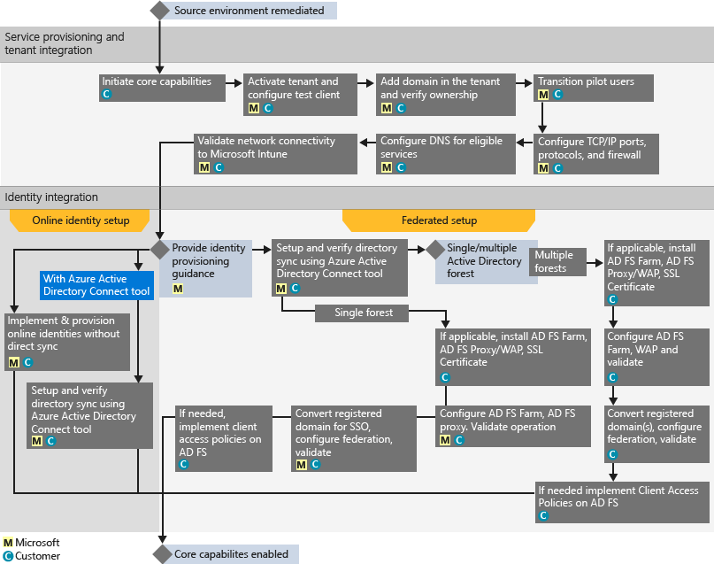

# Az Intune FastTrack Center juttat&#225;s&#225;nak folyamata
Ha munkahelye vagy intézménye jogosult a Microsoft Intune szolgáltatási juttatásra, a Microsoft szakemberei távolról segíteni tudnak a Microsoft Intune-környezet előkészítésében.

A Microsoft Intune azon részét képezi a Microsoft Nagyvállalati mobilitási csomagjának (EMS), amely a mobileszköz-kezelési (MDM) és a mobilalkalmazás-kezelési (MAM) funkciókat is magában foglaló nagyvállalati mobilitásfelügyeleti (EMM) lehetőségeket biztosítja.  A Microsoft Intune eszközkiépítési, eszközkonfigurációs és mobilalkalmazás-telepítési funkciói révén lehetővé teheti munkatársai számára, hogy mobileszközeiken is hatékonyan dolgozhassanak.  A Microsoft Intune emellett az eszközök megfelelőségének figyelésével, a mobilalkalmazások és -adatok védelmével, valamint a vállalati szolgáltatásokhoz való hozzáférés szabályozását lehetővé tevő Azure AD-integrációval a vállalati adatok védelméről is gondoskodik.

További tudnivalók azzal kapcsolatban, hogy a szervezete jogosult-e a szolgáltatás igénybevételére: [Az Intune FastTrack Center juttatása](../Topic/FastTrack_Center_Benefit_for_Intune.md). További információ arról, hogy miként készítheti fel informatikai környezetét a Nagyvállalati mobilitási csomag egyéb szolgáltatásainak használatára: [A Nagyvállalati mobilitási csomag FastTrack Center juttatása](../Topic/FastTrack_Center_Benefit_for_Enterprise_Mobility_Suite.md).

**Információra van szüksége az Office 365-höz készült Microsoft FastTrackről? Lásd az** [Office 365-höz készült Microsoft FastTrack juttatásáról](https://technet.microsoft.com/library/office-365-onboarding-benefit.aspx) szóló témakört.

Ez a cikk a Microsoft Intune szolgáltatási juttatással kapcsolatos alábbi információkat tartalmazza:

-   [Overview of the onboarding process](#overview_onboarding_process)

-   [Expectations for your source environment](#expectations_src_environ)

-   [Phases of the onboarding process](#phases_onboarding_process)

-   [Microsoft responsibilities](#microsoft_responsibilities) az egyes fázisokban

-   [Your responsibilities](#your_responsibilities) az egyes fázisokban

A bevezetés befejezésekor a következők várhatók:

-   Létrejön a Microsoft Online Services-bérlője.

-   A licenccel rendelkező felhasználók a következő identitáslehetőségek egyikével férhetnek hozzá a Microsoft Intune szolgáltatáshoz:

    -   Felhőbeli identitások (egyedi Microsoft Online Services-fiókok).

    -   Szinkronizált identitások: Microsoft Intune-fiókok a helyszíni Active Directoryból szinkronizálva az Azure Active Directory Connect (szinkronizálási szolgáltatások) eszközzel:

        -   Egyetlen Active Directory-erdővel rendelkező ügyfelek esetén.

        -   Többerdős Active Directory-topológiával rendelkező ügyfelek esetén.

-   Összevont identitások – Microsoft Intune-fiókok:

    -   Az Active Directoryból a Microsoft Azure Active Directory Connect eszközzel szinkronizálva olyan ügyfelek esetén, akik egyetlen Active Directory-erdő konfigurációval rendelkeznek, illetve olyanok esetén, akik egyetlen Active Directory-erdő (más néven bejelentkezési erdő) és egyetlen Active Directory-erőforráserdő konfigurációval rendelkeznek.

    -   Összevonva a Windows Server 2012 R2 Active Directory összevonási szolgáltatások (AD FS) szerepkörrel a helyszíni Active Directoryból, illetve összevonva az Active Directory összevonási szolgáltatások (AD FS) 2.0-s vagy újabb verziójával a helyszíni Active Directoryból.

## A bevezetési folyamat  áttekintése
A bevezetés két fő részből áll:

-   **Alapképességek** – a bérlő konfigurációjához és az Azure Active Directoryval való integrációhoz szükséges feladatok (ha vannak ilyenek). Emellett az egyéb jogosult szolgáltatások bevezetéséhez is az alapképességek összetevője biztosítja az alapkonfigurációt.

-   **Szolgáltatások bevezetése** – a Microsoft Intune konfigurálásához szükséges feladatok.

A következő ábra a FastTrack Center juttatás használatának eseménysorozatát ismerteti.

A folyamat alapvetően a következőképpen történik:

-   A FastTrack Center a jogosult csomag vásárlásától számított harminc napon belül megpróbálja felvenni Önnel a kapcsolatot. Ha minden készen áll a szolgáltatások munkahelyi vagy intézményi üzembe helyezéséhez, a [FastTrack Center](http://fasttrack.microsoft.com/) segítségét is kérheti. Ha segítséget szeretne kérni a Microsoft Intune, a prémium szintű Azure Active Directoryhoz vagy a prémium szintű Azure Rights Managementhez, jelentkezzen be a **externalLink tag is not supported!!!!**

-   A FastTrack Center segítséget nyújt az alapfunkciókkal kapcsolatban, majd minden egyes jogosult szolgáltatás bevezetésében segítenek egy alkalommal.

Az összes bevezetési támogatást távolról nyújtják a Microsoft ezért felelős munkatársai:

-   A Microsoft eszközök, dokumentáció és útmutatás együttes használatával biztosít távoli segítséget a különböző bevezetési tevékenységekhez.

-   A bevezetési támogatást a FastTrack Center biztosítja, és az adott régió szokásos munkaidejében vehető igénybe.

-   A bevezetési támogatás kínai (hagyományos), angol, francia, német, olasz, japán, portugál (brazíliai) és spanyol nyelven érhető el.

-   A Microsoft csapata együttműködhet közvetlenül Önnel vagy az Ön képviselőjével is.

## A forráskörnyezettel kapcsolatos követelmények
Előfordulhat, hogy vannak olyan meglévő szolgáltatások a forráskörnyezetében, melyeket át szeretne helyezi a Microsoft Intune szolgáltatásba, vagy integrálni szeretne azzal. Bizonyos szolgáltatások esetében az Intune-hoz készült FastTrack Center juttatás magában foglalja a forráskörnyezettel való bizonyos fokú integráció beállításának segítését is. Ha integrációra van szükség, akkor a forráskörnyezetnek el kell érnie az adott alkalmazáshoz szükséges minimális szintet.

Az alábbi táblázat a meglévő forráskörnyezettel szembeni bevezetési követelményeket tartalmazza.

|Tevékenység|Forráskörnyezettel szembeni követelmény|
|---------------|-------------------------------------------|
|Alapképességek|Az Active Directory-erdők beállított működési szintje Windows Server 2008 vagy újabb, az alábbi erdőbeállításokkal:  -   Egyetlen Active Directory-erdő -   Több Active Directory-erdő **Note:** Több erdőt tartalmazó konfigurációk esetén az AD FS üzembe helyezése nem része a FastTrack Center juttatásnak.|
|Szolgáltatások bevezetése  -   Microsoft Intune -   A System Center Configuration Managerrel integrált Microsoft Intune|Ha a rendszergazdák a System Center Configuration Manager 2012 R2 vagy újabb verzióval összekapcsolt Microsoft Intune-nal szeretnék kezelni az eszközöket, akkor a **externalLink tag is not supported!!!!** **Note:** A szolgáltatási juttatás nem terjed ki a System Center Configuration Manager azon minimális követelményeknek megfelelő beállítására vagy frissítésére, amelyek a System Center Configuration Managerrel integrált Microsoft Intune-hoz szükségesek.|

## A bevezetési folyamat fázisai
A bevezetés négy elsődleges fázisból áll:

-   Kezdeményezés

-   Felmérés

-   Javítás

-   Engedélyezés

Az egyes lépésekhez tartozó feladatok részletesen [Microsoft responsibilities](#microsoft_responsibilities) és [Your responsibilities](#your_responsibilities) szakaszokban találhatók meg.

### Kezdeményezési fázis
Miután megvásárolta a megfelelő mennyiségű és típusú licenceket, a vásárlást megerősítő e-mail útmutatását követve társítsa a licenceket a meglévő vagy új bérlőjéhez. A FastTrack Center ellenőrzi, hogy az igénylő jogosult-e a szolgáltatási juttatásra. A Microsoft a jogosult csomag vásárlásától számított harminc napon belül megpróbálja felvenni Önnel a kapcsolatot. Ha minden készen áll a szolgáltatások munkahelyi vagy intézményi üzembe helyezéséhez, a [FastTrack Center](http://fasttrack.microsoft.com/) segítségét is kérheti. Ha segítséget szeretne kérni a Microsoft Intune, a prémium szintű Azure Active Directoryhoz vagy a prémium szintű Azure Rights Managementhez, jelentkezzen be a **externalLink tag is not supported!!!!**

Ebben a fázisban fogjuk megvitatni a bevezetési folyamatot, ellenőrizni az adatokat, és megszervezni az indító értekezlet.

### Felmérési fázis
A bevezetési folyamat megkezdése után a Microsoft segít Önnek felmérni a forráskörnyezetét és a követelményeket. A környezet felmérése eszközök futtatásával történik, és a Microsoft végigvezeti Önt az internetböngészők, az ügyféloldali operációs rendszerek, a DNS, a hálózat, az infrastruktúra és az azonosítási rendszer felmérésén annak meghatározására, hogy szükséges-e bármilyen módosítás a bevezetéshez. A jelenlegi beállításai alapján egy javítási tervet biztosítunk, amellyel biztosíthatja, hogy a forráskörnyezete megfeleljen a Microsoft Intune sikeres bevezetése minimális követelményeinek. Emellett a megfelelő ellenőrzőpont-hívások is be lesznek állítva a javítási fázishoz.

### Javítási fázis
Szükség esetén el kell végeznie a javítási tervben szereplő feladatokat a forráskörnyezeten, hogy az megfeleljen az egyes szolgáltatások bevezetése követelményeinek.

Az engedélyezési fázis megkezdése előtt közösen ellenőrizzük a javítási tevékenységek eredményeit, hogy meggyőződjünk arról, készen áll-e a folytatásra.

### Engedélyezési fázis
Az összes javítási tevékenység befejezése után a projekt átvált az alapvető infrastruktúra konfigurálására a szolgáltatások felhasználásához, illetve a Microsoft Intune kiépítésére.

**Engedélyezési fázis – alapképességek**

Az alapképességek engedélyezése magában foglalja a szolgáltatás kiépítését, valamint a bérlők és az identitások integrálását. Emellett olyan lépések is részét képezik, melyek biztosítják az alaprendszert a Microsoft Intune bevezetéséhez.

A Microsoft Intune bevezetése akkor kezdhető meg, amikor befejeződött az alapképességek engedélyezése.

**Engedélyezési fázis – Microsoft Intune**

A Microsoft Intune esetében, és az Ön mobileszköz- és mobilalkalmazás-felügyeleti igényei alapján, segítünk Önnek felkészülni az eszközök Microsoft Intune használatával való kezelésére. A pontos lépések az adott forráskörnyezettől függenek, és a következők lehetnek:

-   A végfelhasználók licencelése. Szükség esetén útmutatást nyújthatunk ahhoz is, hogy miként kell aktiválni az Ön Microsoft-felhőszolgáltatásokat igénybe vevő bérlőjének mennyiségi licenceit.

-   A Microsoft Intune-ban használni kívánt identitások konfigurálása a helyszíni Active Directory vagy a felhőbeli identitások segítségével.

-   Felhasználók hozzáadása a Microsoft Intune-előfizetéshez, rendszergazdai szerepkörök definiálása, valamint felhasználó- és eszközcsoportok létrehozása.

-   Az MDM-szolgáltató beállítása a felügyeleti igények alapján:

    -   Állítsa be a Microsoft Intune-t MDM-szolgáltatóként, ha a Microsoft Intune-t egyetlen MDM-megoldásként vagy az Office 365 mobileszköz-kezelési megoldásával együtt használja.

    -   Ha a System Center Configuration Manager meglévő implementációjával rendelkezik, és annak felügyeleti funkciói a Microsoft Intune-nal szeretné hasznosítani, állítsa be a Configuration Managert MDM-szolgáltatóként.

        > [!NOTE]
        > Ha a mobilalkalmazás-felügyeletet csak a végfelhasználók saját tulajdonú eszközeire, a megosztott eszközökre és a teljes képernyős típusú eszközökre kívánja kiterjeszteni, nem szükséges MDM-szolgáltatót beállítania.

-   Ha mobileszköz-felügyeleti szolgáltatásainkat szeretné igénybe venni, a következőkhöz nyújtunk segítséget:

    -   Az MDM-felügyeleti szabályzatok ellenőrzésére használt tesztcsoportok beállítása.

    -   Többek között az alábbi MDM-felügyeleti szabályzatok és szolgáltatások konfigurálása:

        -   Webes hivatkozással vagy mélyhivatkozással történő alkalmazástelepítés minden támogatott platformon.

        -   Feltételes hozzáférési szabályzatok.

        -   E-mail profilok üzembe helyezése.

        -   A Microsoft Intune Exchange Connector beállítása, ha alkalmazható.

    -   [Támogatott platformonként](https://technet.microsoft.com/library/dn600287.aspx) legfeljebb két teszteszköz regisztrálása a Microsoft Intune-ban vagy a Microsoft Intune-nal együtt használt Configuration Managerben.

    -   Szoftver- és hardver-leltárjelentések használata.

-   Ha mobilalkalmazás-felügyeleti (MAM) szolgáltatásainkat szeretné igénybe venni, illetve egy Microsofttól vagy harmadik féltől származó meglévő MDM-megoldást szeretne MAM-szabályzatokkal kiegészíteni, a következőkhöz nyújtunk segítséget:

    -   MAM-szabályzatok konfigurálása minden támogatott platformon.

    -   Felügyelt alkalmazások számára létrehozott feltételes hozzáférési szabályzatok konfigurálása.

    -   A fenti MAM-szabályzatok eljuttatása a megfelelő felhasználói célcsoportokhoz.

    -   A felügyelt alkalmazásokról készült használati jelentések használata.

-   Ha számítógép-felügyeleti szolgáltatásainkat szeretné igénybe venni, a következőkhöz nyújtunk segítséget:

    -   Ha szükséges, az Intune-ügyfélszoftver telepítése.

    -   Az Intune-ban rendelkezésre álló szoftver- és hardverjelentések használata.

## A Microsoft feladatkörei
Ebben a szakaszban a Microsoft néhány, a bevezetési folyamat során teljesítendő feladata van felsorolva.

### Általános

-   Távsegítség nyújtása a szükséges konfigurálási tevékenységekkel kapcsolatban a fázisok részletes leírásában megadottaknak megfelelően.

-   A rendelkezésre álló dokumentáció, szoftvereszközök, felügyeleti konzolok és parancsfájlok biztosítása a konfigurációs feladatok csökkentése vagy kiküszöbölése érdekében.

### Kezdeményezési fázis

-   Kapcsolatfelvétel az új bérlőhöz tartozó jogosult licencek megvásárlásától számított 30 napon belül.

-   Együttműködés Önnel a bevezetés megkezdése céljából.

-   A bevezetni kívánt jogosult szolgáltatások meghatározása.

### Felmérési fázis

-   Rendszergazdai áttekintés biztosítása.

-   Útmutatás biztosítása a következőkkel kapcsolatban:

    -   DNS-, hálózati és infrastrukturális igények.

    -   Ügyféloldali igények (internetböngészők, az ügyféloldali operációs rendszer és a szolgáltatások igényei).

    -   Felhasználók identitása és átadása.

    -   A megvásárolt és a bevezetés részeként meghatározott jogosult szolgáltatások engedélyezése.

-   A javítási tevékenységek ütemtervének kialakítása.

-   Javítási ellenőrzőlista biztosítása.

### Javítási fázis

-   Konferenciahívások lefolytatása Önnel a javítási tevékenységek előrehaladásának felülvizsgálatára az elfogadott ütemezés szerint.

-   Segítség nyújtása az eszközök futtatásához a problémák azonosítása és javítása érdekében, illetve az eredmények értelmezéséhez.

### Engedélyezési fázis
Útmutatás biztosítása a következőkkel kapcsolatban:

-   A Microsoft Online Services-bérlő aktiválása.

-   A TCP/IP protokoll és a tűzfalportok konfigurálása.

-   A DNS konfigurálása a jogosult szolgáltatásokhoz.

-   A Microsoft Online Services-szolgáltatásokkal létesített kapcsolatok ellenőrzése.

-   Egy erdővel rendelkező környezetben:

    -   Szükség esetén egy, az Active Directory tartományi szolgáltatások (AD DS) és a jogosult Microsoft Online Services-szolgáltatás(ok) közötti címtár-szinkronizáló kiszolgáló telepítése.

    -   A jelszavak (jelszókivonat) Microsoft Intune-ba (Azure Active Directory) történő szinkronizálásának konfigurálása az Azure Active Directory Connect eszközzel.

        > [!NOTE]
        > Az egyéni szabálybővítmények fejlesztése és megvalósítása kívül esik a hatókörön.

-   Egyetlen erdő esetén, ha a cél összevont identitások kialakítása: Az Active Directory összevonási szolgáltatások (AD FS) telepítése és beállítása a Microsoft Intune-nal való helyi tartományi hitelesítéshez egy egyhelyes, hibatűrő konfigurációban, ha szükséges.

    > [!NOTE]
    > Az AD FS-telepítések az összes több erdővel rendelkező konfiguráció esetén kívül esnek a hatókörön.

-   Az egyszeri bejelentkezési (SSO) funkció tesztelése, ha telepítve van.

#### Engedélyezési fázis – Microsoft Intune
Útmutatás biztosítása az alábbiakhoz:

-   A végfelhasználók licencelése. Szükség esetén útmutatást nyújthatunk ahhoz is, hogy miként kell aktiválni az Ön Microsoft-felhőszolgáltatásokat igénybe vevő bérlőjének mennyiségi licenceit.

-   A Microsoft Intune-ban használni kívánt identitások konfigurálása a helyszíni Active Directory vagy a felhőbeli identitások segítségével.

-   Felhasználók hozzáadása a Microsoft Intune-előfizetéshez, rendszergazdai szerepkörök definiálása, valamint felhasználó- és eszközcsoportok létrehozása.

-   Az MDM-szolgáltató beállítása a felügyeleti igények alapján:

    -   Állítsa be a Microsoft Intune-t MDM-szolgáltatóként, ha a Microsoft Intune-t egyetlen MDM-megoldásként vagy az Office 365 mobileszköz-kezelési megoldásával együtt használja.

    -   Ha a System Center Configuration Manager meglévő implementációjával rendelkezik, és annak felügyeleti funkciói a Microsoft Intune-nal szeretné hasznosítani, állítsa be a Configuration Managert MDM-szolgáltatóként.

        > [!NOTE]
        > Ha a mobilalkalmazás-felügyeletet csak a végfelhasználók saját tulajdonú eszközeire, a megosztott eszközökre és a teljes képernyős típusú eszközökre kívánja kiterjeszteni, nem szükséges MDM-szolgáltatót beállítania.

-   Ha mobileszköz-felügyeleti szolgáltatásainkat szeretné igénybe venni, a következőkhöz nyújtunk segítséget:

    -   Az MDM-felügyeleti szabályzatok ellenőrzésére használt tesztcsoportok beállítása.

    -   Többek között az alábbi MDM-felügyeleti szabályzatok és szolgáltatások konfigurálása:

        -   Webes hivatkozással vagy mélyhivatkozással történő alkalmazástelepítés minden támogatott platformon.

        -   Feltételes hozzáférési szabályzatok.

        -   E-mail profilok üzembe helyezése.

        -   A Microsoft Intune Exchange Connector beállítása, ha alkalmazható.

    -   Támogatott platformonként legfeljebb két teszteszköz regisztrálása a Microsoft Intune-ban vagy a Microsoft Intune-nal együtt használt Configuration Managerben.

    -   Szoftver- és hardver-leltárjelentések használata.

-   Ha mobilalkalmazás-felügyeleti (MAM) szolgáltatásainkat szeretné igénybe venni, illetve egy harmadik féltől származó meglévő MDM-megoldást szeretne MAM-szabályzatokkal kiegészíteni, a következőkhöz nyújtunk segítséget:

    -   MAM-szabályzatok konfigurálása minden támogatott platformon.

    -   Felügyelt alkalmazások számára létrehozott feltételes hozzáférési szabályzatok konfigurálása.

    -   A fenti MAM-szabályzatok eljuttatása a megfelelő felhasználói célcsoportokhoz.

    -   A felügyelt alkalmazásokról készült használati jelentések használata.

-   Ha számítógép-felügyeleti szolgáltatásainkat szeretné igénybe venni, a következőkhöz nyújtunk segítséget:

    -   Ha szükséges, az Intune-ügyfélszoftver telepítése.

    -   Az Intune-ban rendelkezésre álló szoftver- és hardverjelentések használata.

## Az Ön feladatkörei
Ebben a szakaszban az Ön néhány, a bevezetési folyamat során teljesítendő feladata van felsorolva.

### Általános

-   A Microsoft Online Services-bérlő minden, a cikkben szereplő konfigurálható beállításain túli fejlesztése és integrációja.

-   A programok és a projekt általános erőforrás-kezelése.

-   Végfelhasználói kommunikáció, dokumentáció, képzés és változáskezelés.

-   Segélyszolgálat dokumentációja és képzése.

-   A szervezetben esetlegesen használt jelentések, bemutatók vagy jegyzőkönyvek elkészítése.

-   A szervezetben használt architekturális és technikai dokumentáció létrehozása.

-   A hardverek és a hálózat megtervezése, beszerzése, telepítése és konfigurálása.

-   Szoftverek beszerzése, telepítése és konfigurálása.

-   A Microsoft Intune-hoz szükséges ügyfélszoftverek konfigurálása, csomagolása és terjesztése.

-   Mobileszközök aktiválása.

-   A hálózat konfigurálása, elemzése, sávszélességének ellenőrzése, tesztelése és figyelése.

-   Technikai változáskezelési jóváhagyási folyamat kezelése és a kapcsolódó dokumentáció létrehozása.

-   Csoportházirendek megadása és definiálása a felhasználók, a munkaállomások és a kiszolgálók kezeléséhez.

-   Az operatív modell és a műveletek útmutatóinak módosítása.

-   Többtényezős hitelesítés beállítása.

-   Forráskörnyezetek (például egyéb PC- vagy eszközkezelési megoldások) leszerelése és eltávolítása.

-   A tesztkörnyezet létrehozása és fenntartása.

-   Szervizcsomagok és egyéb szükséges frissítések telepítése az infrastruktúra-kiszolgálókra.

-   Nyilvános SSL-tanúsítványok biztosítása és konfigurálása, ha szükséges.

-   A szervezet azon használati feltételeket tartalmazó nyilatkozatának elkészítése, amelyet a végfelhasználók számára elérhető vállalati portálon kíván beállítani és megjeleníteni.

### Kezdeményezési fázis

-   Együttműködés a Microsoft csapatával a jogosult szolgáltatások bevezetésének megkezdése céljából.

-   Részvétel a kapcsolatfelvételi indító értekezleten, a szervezeti résztvevők kezelése és vezetése, és a javítási ütemtervek jóváhagyása.

### Felmérési fázis

-   A megfelelő résztvevők azonosítása (beleértve egy projektmenedzsert), akik elvégzik a szükséges felmérési tevékenységeket.

-   Igény esetén a képernyő megosztása a Microsofttal, amikor útmutatásra van szüksége a kiértékelőeszközök a környezeten vagy a Microsoft Intune-előfizetésen való futtatása közben.

-   Részvétel az értekezleteken a javítási feladatlista létrehozása, illetve az infrastruktúra, a hálózat, a felügyelet, a címtár-szinkronizálás előkészítése, a hálózati biztonság, és az összevont identitások témaköreit magába foglaló általános tervhez való hozzájárulás érdekében.

-   Részvétel a felhasználók átadásának megközelítését felvázoló értekezleteken.

-   Részvétel az online szolgáltatások konfigurálásával foglalkozó értekezleteken.

-   Támogatási terv készítése az áttelepítésre való készenlét biztosítására.

### Javítási fázis

-   A felmérési fázisban azonosított javítási tevékenységek elvégzéséhez szükséges lépések végrehajtása.

-   Részvétel az ellenőrző értekezleteken.

### Engedélyezési fázis

-   Igény esetén a képernyő megosztása a Microsofttal, amikor útmutatásra van szüksége a környezet vagy a Microsoft Online Services-szolgáltatás előfizetésének módosítása közben.

-   Az erőforrások kezelése, ha szükséges.

-   A hálózattal kapcsolatos elemek konfigurálása a Microsoft útmutatásának megfelelően.

-   A címtár készenlétének biztosítása és a címtár-szinkronizálás konfigurálása a Microsoft útmutatásának megfelelően.

-   A biztonsággal kapcsolatos infrastruktúra (például a tűzfalportok) konfigurálása a Microsoft útmutatásának megfelelően.

-   A megfelelő ügyféloldali infrastruktúra implementálása.

-   A felhasználó-átadási megközelítés implementálása a Microsoft útmutatásának megfelelően.

-   Különböző szolgáltatások engedélyezése a Microsoft útmutatásának megfelelően.

-   Együttműködés a Microsofttal annak érdekében, hogy minden jogosult szolgáltatás bevezetése befejeződjön a bevezetés megkezdésétől számított 12 hónapon belül.

-   Teszteszközök használata a kezelési házirendek a Microsoft Intune-ban való engedélyezésekor, ha engedélyezi PC-k vagy mobileszközök a Microsoft Intune-nal való kezelését. Ha nem állnak rendelkezésre teszteszközök, az ügyfelek felelőssége, hogy a Microsoft Intune engedélyezésének fázisa során használt eszközökről biztonsági mentést készítsenek, illetve szükség esetén visszaállítsák azok teljes tartalmat.

-   A Microsoft Intune által támogatott platformonként legfeljebb két webes hivatkozással vagy mélyhivatkozással telepíthető alkalmazás kiválasztása.

-   A Microsoft Intune szolgáltatások alapkonfigurációjának és -funkcióinak teszteléséhez használtakon túli biztonsági házirendek kezelése, konfigurálása és alkalmazása.

## Szeretne többet megtudni?
További tudnivalók: [Microsoft Intune](http://www.microsoft.com/en-us/server-cloud/products/microsoft-intune/default.aspx) és a [Nagyvállalati mobilitási csomag](http://www.microsoft.com/en-us/server-cloud/products/enterprise-mobility-suite/default.aspx).

